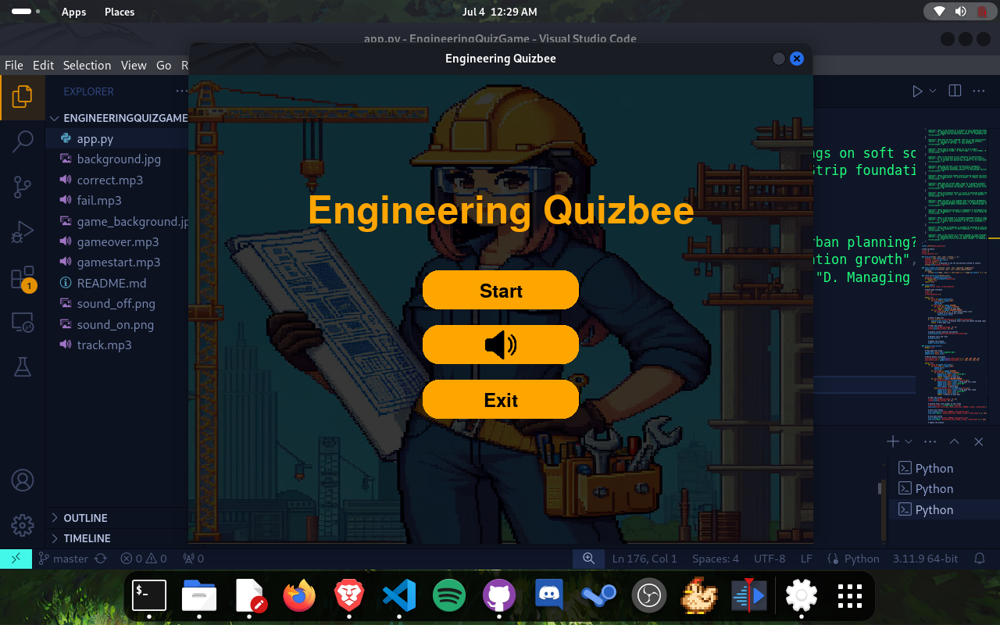
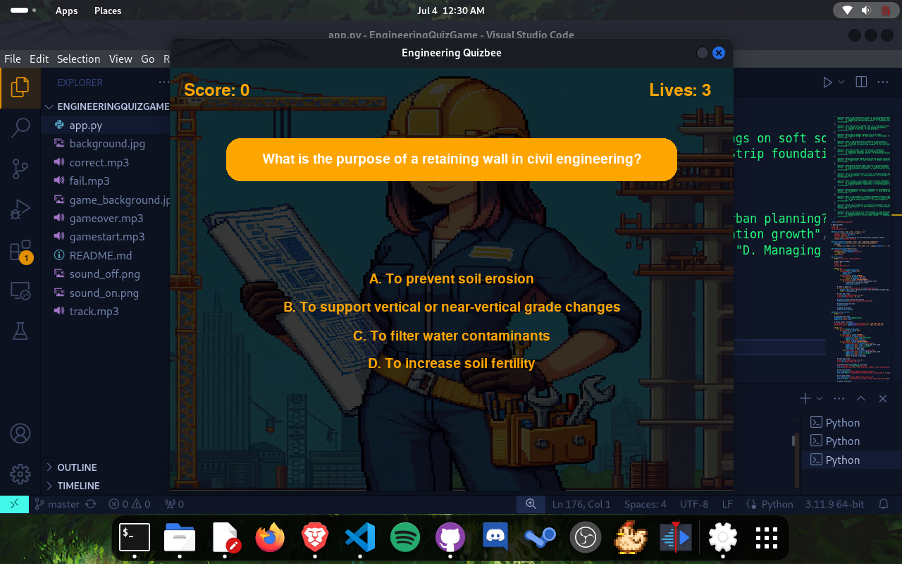
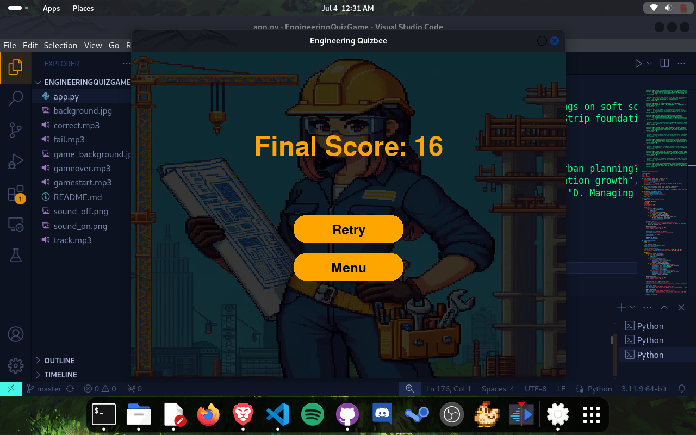

# Engineering Quizbee

Engineering Quizbee is a game designed to test the knowledge of engineering students in the field of Civil Engineering. The game is built using Python and the Pygame library, offering a menu system, scoring system, lives system, and multimedia sounds and graphics.

## Features

- **Menu System**: Navigate through the game's main menu to start the game, toggle sound, or exit the application.
- **Scoring System**: Earn points for each correct answer.
- **Lives System**: Lose a life for each incorrect answer.
- **Multimedia**: Enjoy graphics and sounds that enhance the gameplay experience.

## Requirements

To run this game, you need to have Python and Pygame installed on your system.

### Install Python

Download and install Python from the official website: [Python.org](https://www.python.org/)

### Install Pygame

You can install Pygame using pip:

```bash
pip install pygame
```

### Screenshots





